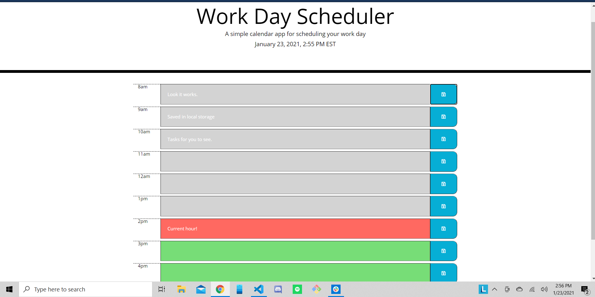
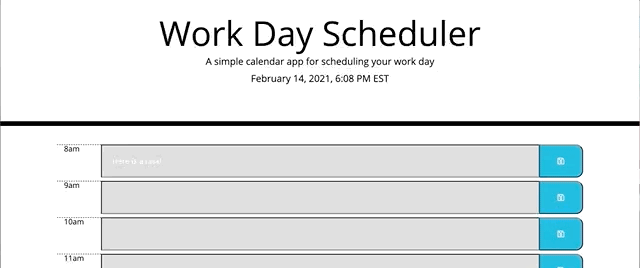

# Calendar App


  


## Write-Up  
For this homework I set myself the task of generating everything through jQuery. It wasn't required, but I knew that everything in this homework could be completed using jQuery, it would just take a little more thinking. 

I figured that I could always have html to fall back on if it became too overwhelming. 

My main complication was figuring out the issues I was having with the ids. First it was a .attr problem but then it was a generating problem. I couldn't figure out how to even add ids for a second, but fortunately after asking the class, I spotted my problem. 

After that, my issue was that the ids ended up all the same, and I wasn't sure how to fix that. If you go through my commit history, you'll see I was generating only one hourDiv that I appended to each main div so the ids were constantly being rewritten. The problem was how I was appending things. I was appending the new divs to themselves as I went through the for loop. Which meant I ended up with a huge mess, so I had to rethink what I was doing there. After figuring out how to use my for loop to actually create multiple hourDivs, I could then attach the ids the way I wanted to. 

There are some places where I chose to use static arrays. This is because I wanted an easier way to build my logic for rendering the backgrounds for the input boxes. I figured I could use the time from [Luxon](https://moment.github.io/luxon/) and compare that to the ids for my hourDivs to render the backgrounds. I ended up using two arrays, one to display text and one to add data that I could use for my logic. I'm sure there's a way to write this so that the text is dynamic as well, but writing that logic seemed like a lot of math and I mostly wanted to make sure I was using the API correctly, instead of fighting with the best way to generate military time in my code. I think now I could probably do it, and maybe I'll come back and give it a whirl at a later date. 

The thing I'm most proud of is this piece of code:

```java
function checkTime() {
   
    for (var i = 0; i < hours.length; i++) {

        var testHour = $("div#time-" + hoursMil[i]).data("hour")
        if (testHour == currentHour) {
            $("input#" + hoursMil[i]).addClass("present");
        }
        else if (testHour < currentHour) {
            $("input#" + hoursMil[i]).addClass("past");
        }
        else if (testHour > currentHour) {
            $("input#" + hoursMil[i]).addClass("future");
        }

    }

};
```
It represents not only that I was able to create unique ids dynamically, but that I figured out how to select those ids, compare them to the API, and then use that to dynamically update the page. I feel pretty good about it!

I needed some help with the local storage, which necessitated some editing of this loop, but I came up with the loop myself and I'm very proud that I figured it out. A few weeks ago, I don't think I would have known where to start. 

### How it works  


## Deployed Site

[Repo](https://github.com/a-andres1/password-generator.git)  
[Deployed Site](https://a-andres1.github.io/fun-time-calendar-app/)


## Technologies Used
jQuery  
Javascript  
[Luxon](https://moment.github.io/luxon/)  

## License
MIT License

Copyright (c) 2021 a-andres1

Permission is hereby granted, free of charge, to any person obtaining a copy
of this software and associated documentation files (the "Software"), to deal
in the Software without restriction, including without limitation the rights
to use, copy, modify, merge, publish, distribute, sublicense, and/or sell
copies of the Software, and to permit persons to whom the Software is
furnished to do so, subject to the following conditions:

The above copyright notice and this permission notice shall be included in all
copies or substantial portions of the Software.

THE SOFTWARE IS PROVIDED "AS IS", WITHOUT WARRANTY OF ANY KIND, EXPRESS OR
IMPLIED, INCLUDING BUT NOT LIMITED TO THE WARRANTIES OF MERCHANTABILITY,
FITNESS FOR A PARTICULAR PURPOSE AND NONINFRINGEMENT. IN NO EVENT SHALL THE
AUTHORS OR COPYRIGHT HOLDERS BE LIABLE FOR ANY CLAIM, DAMAGES OR OTHER
LIABILITY, WHETHER IN AN ACTION OF CONTRACT, TORT OR OTHERWISE, ARISING FROM,
OUT OF OR IN CONNECTION WITH THE SOFTWARE OR THE USE OR OTHER DEALINGS IN THE
SOFTWARE.

[License](LICENSE)

## Contact Info
[email me](mailto:alyssaandres1@gmail.com)  
[find me on github](https://github.com/a-andres1)

### Notes

As a note, I chose the hours 8am to 6pm for flexibility in your work day.

